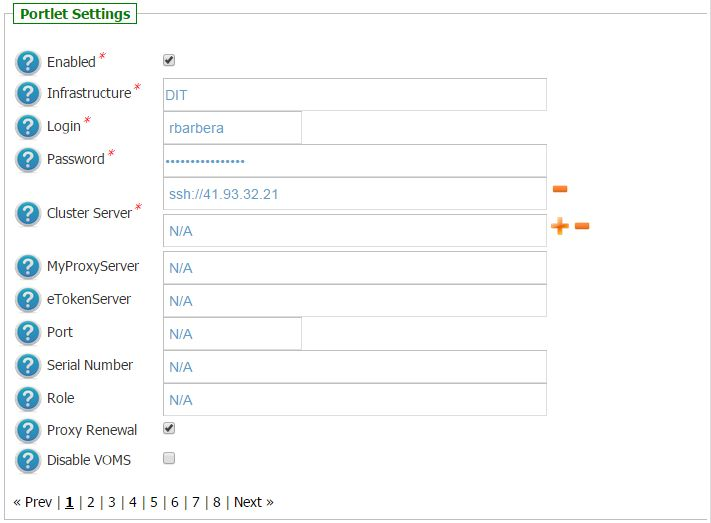

*********************
WRF v1.0.3 Docs
*********************

============
About
============

-------------

.. _1: http://www.wrf-model.org/
.. _2: https://sgw.africa-grid.org/
.. _3: http://www.eumedgrid.eu/
.. _4: http://www.dit.ac.tz/
.. _5: https://www.chain-project.eu/

The Weather Research and Forecasting (WRF) modelling system [1_] is a widely used meso-scale numerical weather prediction system designed to serve both atmospheric research and operational forecasting needs.

WRF has a large worldwide community counting more than 20,000 users in 130 countries and it has been specifically designed to be the state-of-the-art atmospheric simulation system being portable and running efficiently on available parallel computing platforms.

============
Installation
============
To install this portlet the WAR file has to be deployed into the application server.

As soon as the portlet has been successfully deployed on the Science Gateway the administrator has to configure:

- the list of e-Infrastructures where the application can be executed;

- some additional application settings.

1.) To configure a generic e-Infrastructure, the following settings have to be provided:

**Enabled**: A true/false flag which enables or disable the generic e-Infrastructure;

**Infrastructure**: The acronym to reference the e-Infrastructure;

**VOName**: The VO for this e-Infrastructure;

**TopBDII**: The Top BDII for this e-Infrastructure;

**WMS Endpoint**: A list of WMS endpoint for this e-Infrastructure (max. 10);

**MyProxyServer**: The MyProxyServer for this e-Infrastructure;

**eTokenServer**: The eTokenServer for this e-Infrastructure;

**Port**: The eTokenServer port for this e-Infrastructure;

**Serial Number**: The MD5SUM of the robot certificate to be used for this e-Infrastructure;

In the following figure is shown how the portlet has been configured to run simulation on the DIT e-Infrastructure [4_].

In the following figure is shown how the portlet has been configured to run simulation on the CHAIN-REDS Cloud Testbed [5_].

In the following figure is shown how the portlet has been configured to run simulation on the EUMEDGRIDSupport e-Infrastructure [3_].

2.) To configure the application, the following settings have to be provided:

**AppID**: The ApplicationID as registered in the UserTracking MySQL database (GridOperations table);

**Software TAG**: The list of software tags requested by the application;

**SMTP Host**: The SMTP server used to send notification to users;

**Sender**: The FROM e-mail address to send notification messages about the jobs execution to users;

In the figure below is shown how the application settings have been configured to run on the Africa Grid Science Gateway [2_].

.. image:: images/WRF_settings.jpg
   :align: center

============
Usage
============

To run the PoC the user has to click on the *third* accordion of the portlet and start the forecasting analysis as shown in the below figure:

Each simulation will produce:

- *std.out*: the standard output file;

- *std.err*: the standard error file;

- *.tar.gz*: containing the results of the Monte Carlo simulation.

A typical simulation produces, at the end, the following files:

.. code:: bash

        ]$ tree SequenceAlignmentSimulationStarted_126163/
        SequenceAlignmentSimulationStarted_126163/
        ├── std.err
        ├── std.out
        ├── output.README
        └── outputs.tar.gz

        ]$ tar zxvf outputs.tar.gz 
        20150601120928_larocca.aln
        20150601120928_larocca.dnd

============
Support
============
Please feel free to contact us any time if you have any questions or comments.

.. _INFN: http://www.ct.infn.it/
.. _KTH: https://www.kth.se/en
.. _UoB: http://www.uib.no

:Authors:
 
 `Roberto BARBERA <mailto:roberto.barbera@ct.infn.it>`_ - Italian National Institute of Nuclear Physics (INFN_),
 
 `Riccardo BRUNO <mailto:riccardo.bruno@ct.infn.it>`_ - Italian National Institute of Nuclear Physics (INFN_),

 `Giuseppe LA ROCCA <mailto:giuseppe.larocca@ct.infn.it>`_ - Italian National Institute of Nuclear Physics (INFN_),
 
 `Bjorn PEHRSON <mailto:bpehrson@kth.se>`_ - Royal Institute of Technology (KTH_),
 
 `Torleif MARKUSSEN LUNDE <mailto:torleif.lunde@cih.uib.no>`_ - University of Bergen (UoB_),
 
:Version: v1.0.3, 2015

:Date: June 1st, 2015 13:23
